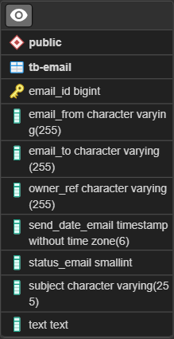

# Send-Email-API

<p>O Send Email API é um micro serviço de envio de e-mails.</p>

## Modelagem do Banco de Dados


### Tecnologias Usadas:
 - Java17
 - Spring Boot
    - Dependências do Spring Boot
        - Spring Data JPA
        - Java Mail Sender 
        - Spring Web
        - PostgreSQL Driver
        - Validation
 - Maven
 - PostgreSQL
 - Foi usado o SMTP do Gmail para gerenciar o envio dos e-mails.

### Endpoints da API

**[Post]** http://localhost:8080/email/send
<p>Este endpoint é responsável pelo envio dos e-mails.
</p>

**Body - JSON**

```
{
	"ownerRef":"Nome de quem está enviando o e-mail",
	"emailFrom":"******@gmail.com",
	"emailTo":"******@gmail.com",
	"subject":"Titulo",
	"text":"Texto a ser envia"
}
```

<p>O e-mail que vai no campo 'emailFrom' é o que está configurado no arquivo 'application.properties'. Neste mesmo arquivo, tem a seguinte configuração 'spring.mail.password'. Neste campo, não é para colocar a senha do seu e-mail, mas sim a senha de APP configurada.</p>

**[Get]** http://localhost:8080/email/historic
<P>Este endpoint retorna um JSON com o histórico de todos os e-mails enviados.</P>
